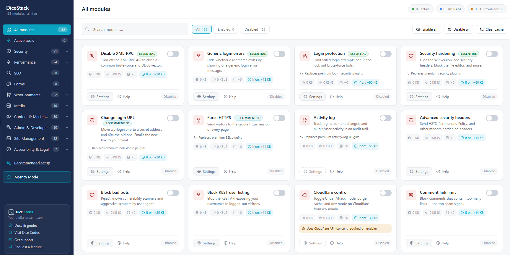
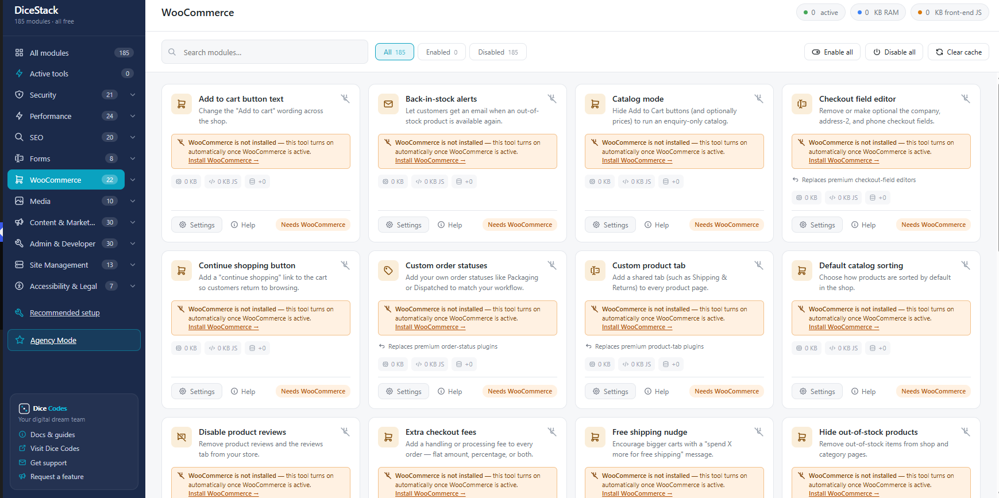
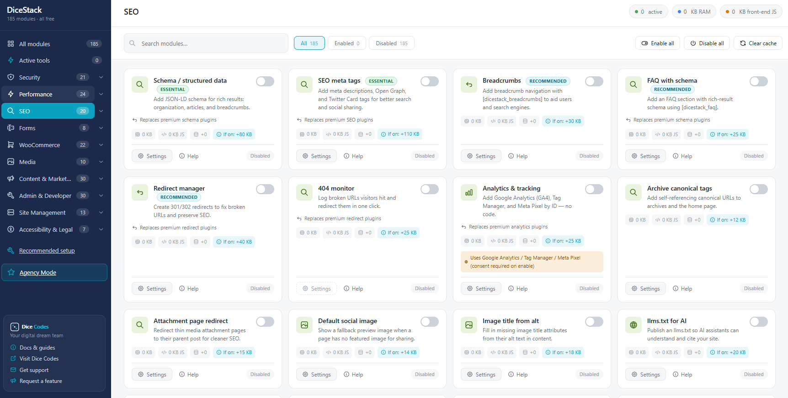
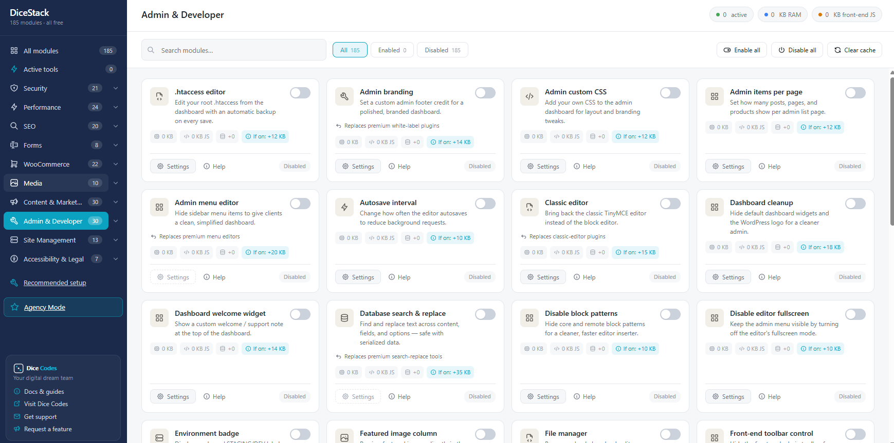

# DiceStack — Free All-in-One WordPress Plugin (185 Tools)

> **One plugin. Every tool. Always free.** DiceStack bundles **185 modular tools** for security, performance, SEO, WooCommerce, caching, backups, forms, and site management into a single lightweight dashboard — and you turn on **only what you need**. Disabled tools load **zero code**, so your site stays fast.

**Built by [Dice Codes](https://dicecodes.com) — your digital dream team.**

🔗 **[Download on WordPress.org](https://wordpress.org/plugins/dicestack/)** &nbsp;•&nbsp; 🌐 **[Plugin Home](https://dicecodes.com/dicestack-wordpress-plugin/)** &nbsp;•&nbsp; 📖 **[Documentation](https://dicecodes.com/dicestack/docs/)**

---

## Why DiceStack?

Most WordPress sites run a dozen plugins — one for caching, one for security, one for SEO, another for backups — each adding weight, cost, and conflicts. **DiceStack replaces that whole stack** with one free, modular toolkit:

- **🧩 185 tools, one install** — security, performance, SEO, WooCommerce, media, marketing, admin, accessibility and more.
- **⚡ Zero bloat by design** — every tool is off until you enable it, and disabled tools load **no PHP, JS, or CSS**. The dashboard shows the exact RAM / JS / DB cost of each tool *before* you turn it on.
- **💯 100% free, forever** — no "Pro" upsell, no locked features, no nag screens.
- **🛡️ Safe Mode & isolation** — a failing tool auto-disables itself instead of taking down your site.
- **🤝 Conflict-aware** — DiceStack detects plugins you already run (e.g. an SEO or caching plugin) and warns you before enabling an overlapping tool.
- **🏢 Agency Mode** — per-tool control and a 1-click "Recommended setup" that scans your site and enables the right essentials.

---

## Features — 185 tools across 10 categories

| Category | Tools | Examples |
|---|---|---|
| 🛡️ **Security** | 21 | Login URL change, 2FA, firewall rules, XML-RPC control, Cloudflare control, file-change monitor |
| ⚡ **Performance** | 24 | Page cache, object cache (Redis/Memcached drop-in), CSS/JS minify, lazy-load, heartbeat control, GZIP |
| 🔍 **SEO** | 20 | Meta titles & descriptions, schema markup, XML sitemap, robots.txt editor, Open Graph, redirects |
| 📝 **Forms** | 8 | Contact forms, spam protection, submission logging |
| 🛒 **WooCommerce** | 22 | Catalog mode, custom order statuses, checkout field editor, free-shipping nudge, min/max order, extra fees |
| 🖼️ **Media** | 10 | Image optimization, WebP, SVG support, lazy media, bulk compression |
| 📣 **Content & Marketing** | 30 | Reviews, shortcodes, custom code, GA4, popups, related posts |
| 🧰 **Admin & Developer** | 30 | File manager, .htaccess editor, admin menu editor, DB search-replace, config export/import, WP-CLI |
| 🗄️ **Site Management** | 13 | Backups & restore, cloud backup, monthly reports, error monitor, activity log, diagnostics |
| ♿ **Accessibility & Legal** | 7 | Cookie consent, accessibility toolbar, privacy tools |

> 👉 Full tool-by-tool guides: **[dicecodes.com/dicestack/docs](https://dicecodes.com/dicestack/docs/)**

---

## A free alternative to premium WordPress plugins

Looking for a **free alternative** to a paid plugin? DiceStack covers what many premium plugins charge for — in one install, all free:

| Looking for a free alternative to… | Use DiceStack's built-in tools |
|---|---|
| **WP Rocket / W3 Total Cache** (caching) | Page Cache, Object Cache (Redis/Memcached), Minify CSS & JS, Lazy Load, Defer JS |
| **Wordfence / Sucuri** (security) | Login Protection, Change Login URL, Security Hardening, Security Headers, Activity Log, Bad-Bot Blocking, Login Captcha |
| **Yoast SEO Premium / All in One SEO** (SEO) | Meta Tags, Schema / JSON-LD, Breadcrumbs, Canonical Tags, Redirect Manager, robots.txt editor, Analytics (GA4) |
| **Jetpack** (all-in-one) | Performance, security and site-management tools — without the bloat or subscription |
| **UpdraftPlus / BlogVault** (backups) | Backup & Restore, Cloud Backup (FTP / WebDAV / Email / Google Drive) |
| **Imagify / ShortPixel / Smush** (images) | Image Optimizer, WebP / AVIF conversion, bulk compression |
| **WPForms / Gravity Forms** (forms) | Contact Form, Spam Shield, SMTP, universal Submissions Tracker |

Every one of these is **100% free** in DiceStack — no premium tier, no upsell.

---

## Screenshots

| | |
|---|---|
|  |  |
| **The DiceStack dashboard** — every tool shows its exact RAM / JS / DB footprint *before* you enable it. | **Smart dependencies** — WooCommerce tools stay dormant and clearly say "WooCommerce is not installed", with a one-click install link. No dead ends. |
|  |  |
| **Clear, honest tools** — Essential / Recommended tags, "replaces premium plugin" notes, and an upfront consent prompt for any tool that uses an external service. | **Power tools built in** — file manager, .htaccess editor, database search-replace, admin menu editor and more. |

---

## Installation

### From WordPress.org (recommended)
1. In wp-admin go to **Plugins → Add New**.
2. Search for **DiceStack**.
3. Click **Install Now**, then **Activate**.
4. Open the **DiceStack** dashboard and enable the tools you want.

### Manual install
1. Download the latest `dicestack.zip` from the [Releases](https://github.com/IamRamgarhia/DiceStack-free-all-in-one-WordPress-plugin/releases) page or from [WordPress.org](https://wordpress.org/plugins/dicestack/).
2. In wp-admin go to **Plugins → Add New → Upload Plugin** and choose the zip.
3. **Activate**, then open the **DiceStack** dashboard.

---

## How it works

DiceStack uses a **modular architecture**: each tool is a self-contained module that is only loaded when you enable it.

- Disabled module → **0 KB** PHP/JS/CSS, **0** extra DB queries.
- Each card in the dashboard shows the tool's footprint *(e.g. "If on: +12 KB")* so you make informed choices.
- Your enabled/disabled choices **persist across updates** — updating the plugin never re-enables tools or loses settings.

---

## Requirements

- **WordPress** 6.0 or higher
- **PHP** 7.4 or higher
- Some tools need server capabilities (e.g. Redis/Memcached for object cache, Imagick for image optimization, ZipArchive for backups) — DiceStack detects these and clearly marks any tool your server can't run.

---

## FAQ

**Is there a free all-in-one WordPress plugin?**
Yes — DiceStack is a completely free all-in-one WordPress plugin. One install gives you 185 modular tools for security, performance, SEO, WooCommerce, caching, backups and more, with no premium tier and no upsell.

**What's a good free alternative to paid WordPress suites?**
DiceStack replaces a whole stack of separate (and often paid) plugins — caching, security, SEO, backups, forms and an object cache — with one lightweight dashboard. You enable only the tools you need, and disabled tools load zero code, so your site stays fast.

**Is DiceStack a free alternative to WP Rocket, Wordfence, or Yoast?**
Yes. DiceStack includes free, built-in tools that cover caching (like WP Rocket or W3 Total Cache), security (like Wordfence or Sucuri), SEO (like Yoast or All in One SEO), backups (like UpdraftPlus), image optimization (like Smush) and forms (like WPForms) — so one free install can replace several paid plugins. See the comparison table above.

**Is DiceStack really free?**
Yes — every one of the 185 tools is free. There is no premium tier or paid add-on.

**Will it slow my site down?**
No. Tools you don't enable load nothing at all. Enabling the caching and optimization tools typically makes sites **faster**.

**Will it conflict with my existing SEO / caching / security plugin?**
DiceStack detects common plugins and warns you before you enable a tool that overlaps, so you can avoid double-handling.

**Do I need WooCommerce?**
Only for the WooCommerce category. Those tools stay dormant (and clearly marked "Needs WooCommerce") until WooCommerce is active.

**What happens to my settings when I update?**
Nothing changes — enabled tools stay enabled, disabled stay disabled, and all settings are preserved.

---

## Contributing

Issues and pull requests are welcome. Please open an [issue](https://github.com/IamRamgarhia/DiceStack-free-all-in-one-WordPress-plugin/issues) for bugs or feature requests. The canonical release channel for end users is **[WordPress.org](https://wordpress.org/plugins/dicestack/)**.

## License

DiceStack is free software, released under the **[GNU General Public License v2.0 or later](LICENSE)** — the same license as WordPress itself.

## Credits

Designed and built by **[Dice Codes](https://dicecodes.com)**.
📧 Contact@dicecodes.com
